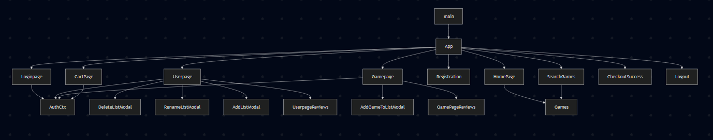
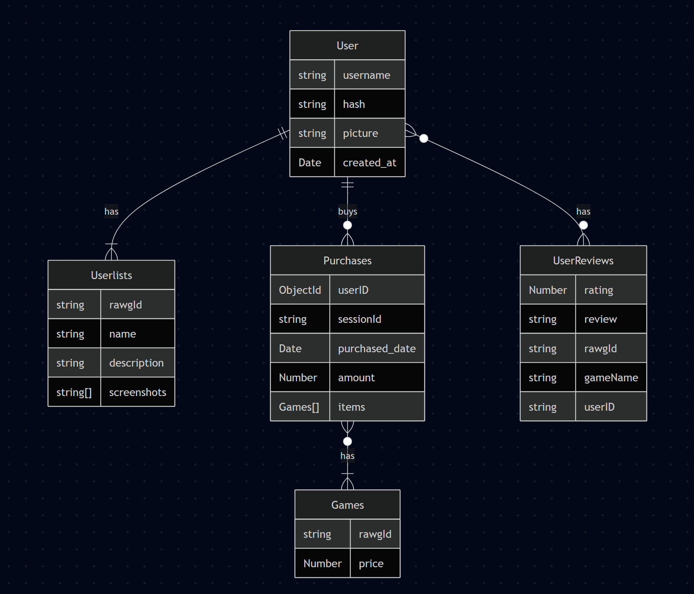

# Abstract

Gamemonger is a demo of a MERN stack game storefront. It pulls in game data from [RawG](https://rawg.io/), and allow users to register and login in order to leave reviews or to purchase games.

> Disclaimer: This project is for demostration purposes only. The Stripe protocol used in this project is a sandbox and will not actually work as an actual storefront.

# Enviroment Variables

### Frontend

- VITE_SERVER: the URI of the backend server

### Backend

- MONGODB_URI: the uri which MongoDB runs in
- PORT: the port the Express app runs in
- ACCESS_SECRET: secret key to access login function
- REFRESH_SECRET: secret key to enter a logged in session
- RAWG_API_KEY: key required to access the external API
  -RAWG_API_DATABASE: The URI to access to RAWG api (https://api.rawg.io/api)
- STRIPE_SANDBOX_SECRET_KEY: secret key for payment pages

# React Component Tree

# MongoDB Database schema

