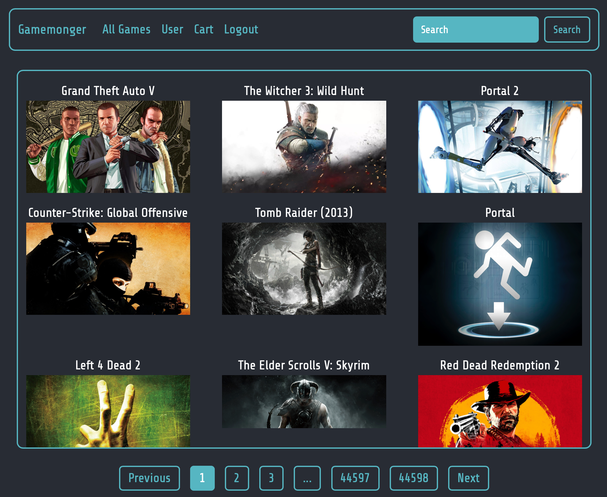
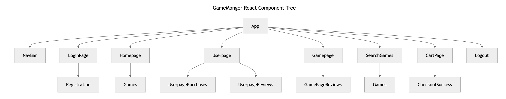
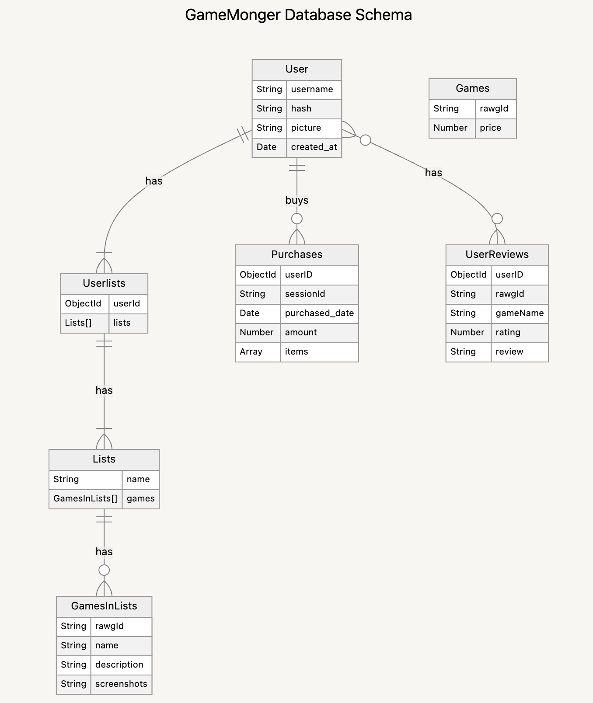
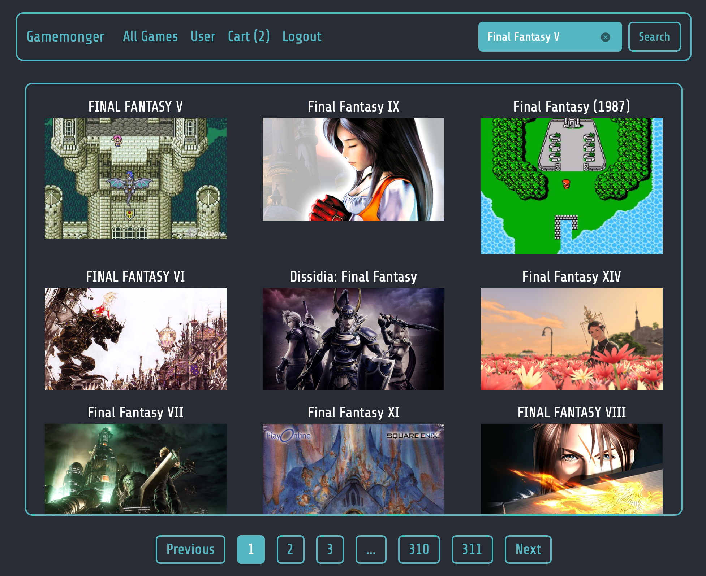
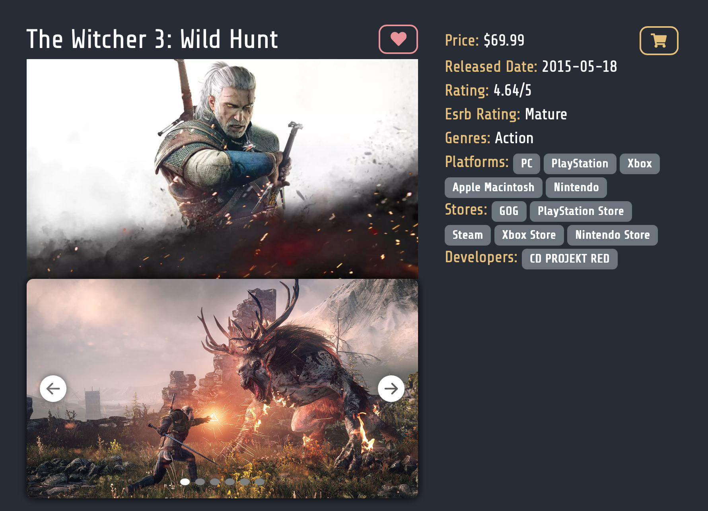
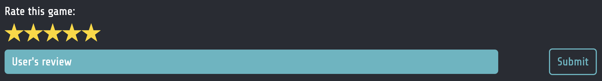
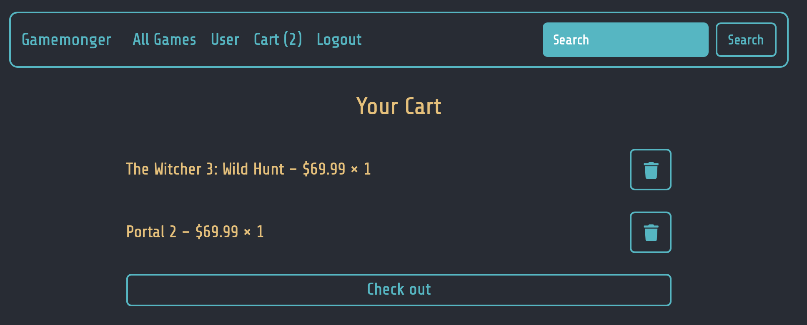

# Gamemonger

Gamemonger is a demo of a MERN stack game storefront and discovery hub. It pulls in game data from [RAWG](https://rawg.io/), and allow users to register and login in order to leave reviews or to purchase games.

> Disclaimer: This project is for demonstration purposes only. The Stripe protocol used in this project is a sandbox and will not actually work as an real storefront.



## Tech Stack

**Core Framework**: MERN stack (MongoDB, Express, React, Node.js)

Other libraries/packages:

- **Frontend**: React Router DOM, React Query, React Paginate
- **Authentication & Security**: JWT, bcrypt, helmet, express-rate-limit, CORS
- **Payment**: Stripe integration

## Features

### 🎮 Core Platform

- **Game Discovery & Search** – browse and filter games by title, genre, and other attributes
- **Game Storefront** – view game details, add to cart, and purchase through Stripe

### 👤 User Features

- **Authentication & Accounts** – secure signup/login using JWT with protected routes
- **Favourites & Wishlists** – save personal game collections for easy access
- **User Reviews** – submit, edit, and view reviews from other players

### 💳 Commerce

- **Cart & Checkout** – persistent shopping cart with item count in navbar
- **Stripe Payments** – checkout flow with Stripe, supporting multiple payment methods
- **Order History** – track past purchases in the user profile page

## Future Updates (maybe)

🗣️ **Instant Messaging** - between users for game discovery and social interaction

## React Component Tree



## MongoDB Database schema



# Running the App

Game details are sourced from the RAWG - you will need to obtain the free API key from [RAWG API](https://rawg.io/apidocs).

## Enviroment Variables

### Client (Front-end)

- VITE_SERVER: the URI of the backend server

### Server (Backend)

- MONGODB_URI: the uri which MongoDB runs in
- PORT: the port the Express app runs in
- ACCESS_SECRET: secret key to access login function
- REFRESH_SECRET: secret key to enter a logged in session
- RAWG_API_KEY: key required to access the external API
- RAWG_API_DATABASE: The URI to access to RAWG api (https://api.rawg.io/api)
- STRIPE_SANDBOX_SECRET_KEY: secret key for payment pages

# App Development

## Client (Front-end)

### Homepage and Game Search

The homepage displayed the top games and allows the users to easily navigate between the various areas in the site, and users may easily search for games with the handy search bar in the navigation bar.

#### Pagination

As RAWG offers a robust collection of games spanning across decades, we elected to paginate the games in the homepage and search page so that users may easily browse through the diverse choices and yet provide a decent load time for each page.

`react-paginate` was used to cleanly render the pagination at the client side:

```Javascript
<ReactPaginate
  previousLabel={"Previous"}
  nextLabel={"Next"}
  breakLabel={"..."}
  breakClassName={"break-me"}
  pageCount={pageCount}
  marginPagesDisplayed={2}
  pageRangeDisplayed={3}
  onPageChange={handlePageClick}
  containerClassName={styles.pagination}
  activeClassName={styles.active}
/>
```



### Gamepage

The gamepage was designed to showcase the basic information of each game that routered from other paths/endpoints and to serve as a favourite and purchase point for the user to proceed to next course of action. And also to leave reviews after playing the game.



#### Screenshot & trailer carousel

User will be served with the game's screenshots and trailers to have the first visual impression of the gameplay. This is designed with carousel concept by mapping the URLs and only displaying the selected one via `const [slide, setSlide] = useState(0)` and condtional `styles.css`.

Conditional css for `Arrow indicators`:

```Javascript
className={ slide === idx ? styles.slide : styles.slideHidden }
```

Conditional css for `Button indicators`:

```Javascript
className={ slide === idx ? styles.indicator : `${styles.indicator} ${styles.indicatorInactive}`}
```

The slide's state is controlled by both the `Arrow indicators` located on the left and right.

```Javascript
  const nextSlide = () => {
    setSlide((prev) =>
      prev === queryGameScreenShots.data.results.length - 1 ? 0 : prev + 1
    );
  };

  const prevSlide = () => {
    setSlide((prev) =>
      prev === 0 ? queryGameScreenShots.data.results.length - 1 : prev - 1
    );
  };
```

#### Review feature


Easy-to-click rating is implemented using stars icon so that provides an interactive experience with the user.

### Game Storefront

The storefront allows users to seamlessly browse available games, add titles to their shopping cart, and view the cart summary at any time. A live cart counter is displayed in the navigation bar for quick reference.
When ready, users can review their selections and proceed to checkout.

> Note: This storefront is implemented as a proof of concept for demonstration purposes. It is not affiliated with or selling games from any actual publishers or distributors.



#### Payment

Payments are powered by **Stripe**, providing a secure and realistic checkout flow:

- When a user initiates checkout, a **Stripe Checkout Session** is created with the selected items.
- Users are redirected to the Stripe-hosted payment portal, which supports credit cards and alternative payment methods.
- After the transaction is processed, users are redirected back to the app. Gamemonger then verifies the payment status by retrieving the Checkout Session details.
- Successful orders are saved in the database, allowing users to review their purchase history on their profile page.

### Loginpage

To support personalized experiences, Gamemonger includes user authentication and account features:

- **Account creation & login**: Users can register to build wishlists, purchase games, and leave reviews.
- **JWT-based authentication**: Sessions are secured with JSON Web Tokens, ensuring robust and stateless security.
- **Personal dashboards**: Each user has access to their own wishlists, order history, and reviews.

---

## Server (Backend)

### Security

- **Helmet** – sets secure HTTP headers to reduce vulnerabilities.
- **express-rate-limit** – protects against brute-force and denial-of-service attacks.
- **JWT Authentication** – provides token-based security for protected routes.
- **bcrypt** – hashes user passwords to ensure secure storage.

### External API Integration

RAWG API calls are proxied through our Express server to:

- Prevent exposure of sensitive API keys.
- Apply request validation and rate limiting before reaching the external API.
- Provide a consistent API layer for the frontend.

### Process flow after HTTP request begins

#### Server to Routers to Controllers to Middleware or Models

1. First HTTP request comes in

```javascript
app.use("/api", rawgApi);
```

2. Diverted to Router

```javascript
router.get("/games", rawgApi.getGamesPaginated);
```

3. Invoked functions within controllers

```javascript
export const getGamesPaginated = async (req, res) => {
  try {
    const data = await fetchDataWithParams2("/games", "GET", undefined, {
      page: req.query.page,
    });

    res.json(data);
  } catch (error) {
    res.status(500).json({ msg: error.message });
  }
};
```

4. Fetch data

```javascript
export const fetchDataWithParams2 = async (endpoint, method, body, params) => {
  const searchParams = new URLSearchParams({
    key: process.env.RAWG_API_KEY,
    ...params,
  });
  const uri = `${
    process.env.RAWG_API_DATABASE
  }${endpoint}?${searchParams.toString()}`;
  const res = await fetch(uri, {
    method,
    headers: {
      "Content-Type": "application/json",
    },
    body: JSON.stringify(body),
  });
  const data = await res.json();

  if (!res.ok) {
    if (data?.errors) {
      throw data.errors[0].msg;
    } else if (data.status === "error") {
      throw data.msg;
    } else {
      throw "an unknown error has occurred, please try again later";
    }
  }
  return data;
};
```

#### Various checks in place throughout the API calls

Basic checks on the incoming HTTP Request

```javascript
app.use(cors());
app.use(helmet());
app.use(limiter);
app.use(express.json());
app.use(express.urlencoded({ extended: false }));
```

### Authentication process

1. Setup path/endpoint

```javascript
app.use("/auth", authRouter);
```

2. Setup CR

```javascript
router.put(
  "/register",
  validateRegistrationData,
  checkErrors,
  authControl.register
);
router.post("/login", validateLoginData, checkErrors, authControl.login);
router.post("/refresh", authControl.refresh);
```

3. Validate input via express-validators

```javascript
export const validateRegistrationData = [
  body("username", "username is required").notEmpty(),
  body("password", "password is required").notEmpty(),
  body("password", "password must be at least 8 characters long").isLength({
    min: 8,
  }),
];

export const validateLoginData = [
  body("username", "username is required").notEmpty(),
  body("password", "password is required").notEmpty(),
];
```

4. Create username & hashed passwords and store in databased

```javascript
export const register = async (req, res) => {
  try {
    const duplicate = await Users.findOne({ username: req.body.username });

    if (duplicate) {
      return res.status(400).json("username has been used");
    }

    // Create new user in Users collection
    const hash = await bcrypt.hash(req.body.password, 12);
    const newUser = await Users.create({
      username: req.body.username,
      hash,
    });

    // Create default wishlist for new user
    await Userlists.create({
      userId: newUser._id,
    });

    res.json({ status: "ok", msg: "user registered" });
  } catch (e) {
    res.status(400).json({ status: "error", msg: "user cannot be registered" });
  }
};
```

5. Create accessToken

```javascript
export const login = async (req, res) => {
  try {
    const user = await Users.findOne({ username: req.body.username });
    if (!user) {
      return res.status(401).json({ status: "error", msg: "login failed" });
    }

    const auth = await bcrypt.compare(req.body.password, user.hash);
    if (!auth) {
      return res.status(401).json({ status: "error", msg: "login failed" });
    }

    const claims = {
      username: req.body.username,
      id: user._id,
    };
    const access = jwt.sign(claims, process.env.ACCESS_SECRET, {
      expiresIn: "20m",
      jwtid: uuidv4(),
    });
    const refresh = jwt.sign(claims, process.env.REFRESH_SECRET, {
      expiresIn: "30d",
      jwtid: uuidv4(),
    });

    res.json({ access, refresh });
  } catch (e) {
    res.status(401).json({ status: "error", msg: "login failed" });
  }
};
```

6. With accessTokens, we can now protect the endpoint if the incoming accessToken is valid.

```javascript
export const auth = (req, res, next) => {
  if (!"authorization" in req.headers) {
    return res.status(400).json({ status: "error", msg: "no token found" });
  }
  const token = req.headers["authorization"].replace("Bearer ", "");
  if (token) {
    try {
      const decoded = jwt.verify(token, process.env.ACCESS_SECRET);
      if (decoded) req.decoded = decoded;
      next();
    } catch (e) {
      return res.status(401).json({ status: "error", msg: "unauthorised" });
    }
  } else {
    return res.status(403).json({ status: "error", msg: "missing token" });
  }
};
```

# Thank you!

Thanks for reading this project! If you have any question, do feel free to contact us!
